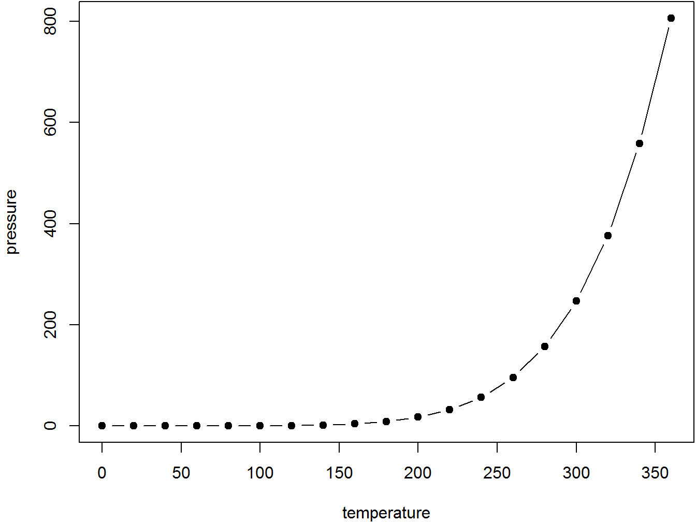

--- 
title: "Introduction to Theoretical Ecology"
author: "Instructor: Po-Ju Ke $~~~~~$ Teaching Assistant: Gen-Chang Hsu"
date: "2021 Fall at National Taiwan Univeristy"
site: bookdown::bookdown_site
documentclass: book
bibliography: [book.bib, packages.bib]
biblio-style: apalike
link-citations: yes
description: "This is the teaching website for **_Introduction to Theoretical Ecology_** 2021 Fall at NTU."
---

# Course description {-}
see the contents on ceiba


## Requirements {-}
see the contents on ceiba


## Objectives {-}
see the contents on ceiba


# Course information {-}
course schedule and location

grading policy

contact info

office hours


# Syllabus {-}
see the contents on ceiba

<table class=" lightable-paper table table-bordered" style="font-size: 20px; font-family: Arial; margin-left: auto; margin-right: auto; margin-left: auto; margin-right: auto;">
 <thead>
  <tr>
   <th style="text-align:center;font-weight: bold;color: black !important;"> Sepal.Length </th>
   <th style="text-align:center;font-weight: bold;color: black !important;"> Sepal.Width </th>
  </tr>
 </thead>
<tbody>
  <tr>
   <td style="text-align:center;font-weight: bold;"> 5.1 </td>
   <td style="text-align:center;width: 30em; "> 3.5 </td>
  </tr>
  <tr>
   <td style="text-align:center;font-weight: bold;"> 4.9 </td>
   <td style="text-align:center;width: 30em; "> 3.0 </td>
  </tr>
  <tr>
   <td style="text-align:center;font-weight: bold;"> 4.7 </td>
   <td style="text-align:center;width: 30em; "> 3.2 </td>
  </tr>
  <tr>
   <td style="text-align:center;font-weight: bold;"> 4.6 </td>
   <td style="text-align:center;width: 30em; "> 3.1 </td>
  </tr>
  <tr>
   <td style="text-align:center;font-weight: bold;"> 5.0 </td>
   <td style="text-align:center;width: 30em; "> 3.6 </td>
  </tr>
  <tr>
   <td style="text-align:center;font-weight: bold;"> 5.4 </td>
   <td style="text-align:center;width: 30em; "> 3.9 </td>
  </tr>
  <tr>
   <td style="text-align:center;font-weight: bold;"> 4.6 </td>
   <td style="text-align:center;width: 30em; "> 3.4 </td>
  </tr>
  <tr>
   <td style="text-align:center;font-weight: bold;"> 5.0 </td>
   <td style="text-align:center;width: 30em; "> 3.4 </td>
  </tr>
  <tr>
   <td style="text-align:center;font-weight: bold;"> 4.4 </td>
   <td style="text-align:center;width: 30em; "> 2.9 </td>
  </tr>
  <tr>
   <td style="text-align:center;font-weight: bold;"> 4.9 </td>
   <td style="text-align:center;width: 30em; "> 3.1 </td>
  </tr>
  <tr>
   <td style="text-align:center;font-weight: bold;"> 5.4 </td>
   <td style="text-align:center;width: 30em; "> 3.7 </td>
  </tr>
  <tr>
   <td style="text-align:center;font-weight: bold;"> 4.8 </td>
   <td style="text-align:center;width: 30em; "> 3.4 </td>
  </tr>
  <tr>
   <td style="text-align:center;font-weight: bold;"> 4.8 </td>
   <td style="text-align:center;width: 30em; "> 3.0 </td>
  </tr>
  <tr>
   <td style="text-align:center;font-weight: bold;"> 4.3 </td>
   <td style="text-align:center;width: 30em; "> 3.0 </td>
  </tr>
  <tr>
   <td style="text-align:center;font-weight: bold;"> 5.8 </td>
   <td style="text-align:center;width: 30em; "> 4.0 </td>
  </tr>
  <tr>
   <td style="text-align:center;font-weight: bold;"> 5.7 </td>
   <td style="text-align:center;width: 30em; "> 4.4 </td>
  </tr>
  <tr>
   <td style="text-align:center;font-weight: bold;"> 5.4 </td>
   <td style="text-align:center;width: 30em; "> 3.9 </td>
  </tr>
  <tr>
   <td style="text-align:center;font-weight: bold;"> 5.1 </td>
   <td style="text-align:center;width: 30em; "> 3.5 </td>
  </tr>
  <tr>
   <td style="text-align:center;font-weight: bold;"> 5.7 </td>
   <td style="text-align:center;width: 30em; "> 3.8 </td>
  </tr>
  <tr>
   <td style="text-align:center;font-weight: bold;"> 5.1 </td>
   <td style="text-align:center;width: 30em; "> 3.8 </td>
  </tr>
  <tr>
   <td style="text-align:center;font-weight: bold;"> 5.4 </td>
   <td style="text-align:center;width: 30em; "> 3.4 </td>
  </tr>
  <tr>
   <td style="text-align:center;font-weight: bold;"> 5.1 </td>
   <td style="text-align:center;width: 30em; "> 3.7 </td>
  </tr>
  <tr>
   <td style="text-align:center;font-weight: bold;"> 4.6 </td>
   <td style="text-align:center;width: 30em; "> 3.6 </td>
  </tr>
  <tr>
   <td style="text-align:center;font-weight: bold;"> 5.1 </td>
   <td style="text-align:center;width: 30em; "> 3.3 </td>
  </tr>
  <tr>
   <td style="text-align:center;font-weight: bold;"> 4.8 </td>
   <td style="text-align:center;width: 30em; "> 3.4 </td>
  </tr>
  <tr>
   <td style="text-align:center;font-weight: bold;"> 5.0 </td>
   <td style="text-align:center;width: 30em; "> 3.0 </td>
  </tr>
  <tr>
   <td style="text-align:center;font-weight: bold;"> 5.0 </td>
   <td style="text-align:center;width: 30em; "> 3.4 </td>
  </tr>
  <tr>
   <td style="text-align:center;font-weight: bold;"> 5.2 </td>
   <td style="text-align:center;width: 30em; "> 3.5 </td>
  </tr>
  <tr>
   <td style="text-align:center;font-weight: bold;"> 5.2 </td>
   <td style="text-align:center;width: 30em; "> 3.4 </td>
  </tr>
  <tr>
   <td style="text-align:center;font-weight: bold;"> 4.7 </td>
   <td style="text-align:center;width: 30em; "> 3.2 </td>
  </tr>
  <tr>
   <td style="text-align:center;font-weight: bold;"> 4.8 </td>
   <td style="text-align:center;width: 30em; "> 3.1 </td>
  </tr>
  <tr>
   <td style="text-align:center;font-weight: bold;"> 5.4 </td>
   <td style="text-align:center;width: 30em; "> 3.4 </td>
  </tr>
  <tr>
   <td style="text-align:center;font-weight: bold;"> 5.2 </td>
   <td style="text-align:center;width: 30em; "> 4.1 </td>
  </tr>
  <tr>
   <td style="text-align:center;font-weight: bold;"> 5.5 </td>
   <td style="text-align:center;width: 30em; "> 4.2 </td>
  </tr>
  <tr>
   <td style="text-align:center;font-weight: bold;"> 4.9 </td>
   <td style="text-align:center;width: 30em; "> 3.1 </td>
  </tr>
  <tr>
   <td style="text-align:center;font-weight: bold;"> 5.0 </td>
   <td style="text-align:center;width: 30em; "> 3.2 </td>
  </tr>
  <tr>
   <td style="text-align:center;font-weight: bold;"> 5.5 </td>
   <td style="text-align:center;width: 30em; "> 3.5 </td>
  </tr>
  <tr>
   <td style="text-align:center;font-weight: bold;"> 4.9 </td>
   <td style="text-align:center;width: 30em; "> 3.6 </td>
  </tr>
  <tr>
   <td style="text-align:center;font-weight: bold;"> 4.4 </td>
   <td style="text-align:center;width: 30em; "> 3.0 </td>
  </tr>
  <tr>
   <td style="text-align:center;font-weight: bold;"> 5.1 </td>
   <td style="text-align:center;width: 30em; "> 3.4 </td>
  </tr>
  <tr>
   <td style="text-align:center;font-weight: bold;"> 5.0 </td>
   <td style="text-align:center;width: 30em; "> 3.5 </td>
  </tr>
  <tr>
   <td style="text-align:center;font-weight: bold;"> 4.5 </td>
   <td style="text-align:center;width: 30em; "> 2.3 </td>
  </tr>
  <tr>
   <td style="text-align:center;font-weight: bold;"> 4.4 </td>
   <td style="text-align:center;width: 30em; "> 3.2 </td>
  </tr>
  <tr>
   <td style="text-align:center;font-weight: bold;"> 5.0 </td>
   <td style="text-align:center;width: 30em; "> 3.5 </td>
  </tr>
  <tr>
   <td style="text-align:center;font-weight: bold;"> 5.1 </td>
   <td style="text-align:center;width: 30em; "> 3.8 </td>
  </tr>
  <tr>
   <td style="text-align:center;font-weight: bold;"> 4.8 </td>
   <td style="text-align:center;width: 30em; "> 3.0 </td>
  </tr>
  <tr>
   <td style="text-align:center;font-weight: bold;"> 5.1 </td>
   <td style="text-align:center;width: 30em; "> 3.8 </td>
  </tr>
  <tr>
   <td style="text-align:center;font-weight: bold;"> 4.6 </td>
   <td style="text-align:center;width: 30em; "> 3.2 </td>
  </tr>
  <tr>
   <td style="text-align:center;font-weight: bold;"> 5.3 </td>
   <td style="text-align:center;width: 30em; "> 3.7 </td>
  </tr>
  <tr>
   <td style="text-align:center;font-weight: bold;"> 5.0 </td>
   <td style="text-align:center;width: 30em; "> 3.3 </td>
  </tr>
  <tr>
   <td style="text-align:center;font-weight: bold;"> 7.0 </td>
   <td style="text-align:center;width: 30em; "> 3.2 </td>
  </tr>
  <tr>
   <td style="text-align:center;font-weight: bold;"> 6.4 </td>
   <td style="text-align:center;width: 30em; "> 3.2 </td>
  </tr>
  <tr>
   <td style="text-align:center;font-weight: bold;"> 6.9 </td>
   <td style="text-align:center;width: 30em; "> 3.1 </td>
  </tr>
  <tr>
   <td style="text-align:center;font-weight: bold;"> 5.5 </td>
   <td style="text-align:center;width: 30em; "> 2.3 </td>
  </tr>
  <tr>
   <td style="text-align:center;font-weight: bold;"> 6.5 </td>
   <td style="text-align:center;width: 30em; "> 2.8 </td>
  </tr>
  <tr>
   <td style="text-align:center;font-weight: bold;"> 5.7 </td>
   <td style="text-align:center;width: 30em; "> 2.8 </td>
  </tr>
  <tr>
   <td style="text-align:center;font-weight: bold;"> 6.3 </td>
   <td style="text-align:center;width: 30em; "> 3.3 </td>
  </tr>
  <tr>
   <td style="text-align:center;font-weight: bold;"> 4.9 </td>
   <td style="text-align:center;width: 30em; "> 2.4 </td>
  </tr>
  <tr>
   <td style="text-align:center;font-weight: bold;"> 6.6 </td>
   <td style="text-align:center;width: 30em; "> 2.9 </td>
  </tr>
  <tr>
   <td style="text-align:center;font-weight: bold;"> 5.2 </td>
   <td style="text-align:center;width: 30em; "> 2.7 </td>
  </tr>
  <tr>
   <td style="text-align:center;font-weight: bold;"> 5.0 </td>
   <td style="text-align:center;width: 30em; "> 2.0 </td>
  </tr>
  <tr>
   <td style="text-align:center;font-weight: bold;"> 5.9 </td>
   <td style="text-align:center;width: 30em; "> 3.0 </td>
  </tr>
  <tr>
   <td style="text-align:center;font-weight: bold;"> 6.0 </td>
   <td style="text-align:center;width: 30em; "> 2.2 </td>
  </tr>
  <tr>
   <td style="text-align:center;font-weight: bold;"> 6.1 </td>
   <td style="text-align:center;width: 30em; "> 2.9 </td>
  </tr>
  <tr>
   <td style="text-align:center;font-weight: bold;"> 5.6 </td>
   <td style="text-align:center;width: 30em; "> 2.9 </td>
  </tr>
  <tr>
   <td style="text-align:center;font-weight: bold;"> 6.7 </td>
   <td style="text-align:center;width: 30em; "> 3.1 </td>
  </tr>
  <tr>
   <td style="text-align:center;font-weight: bold;"> 5.6 </td>
   <td style="text-align:center;width: 30em; "> 3.0 </td>
  </tr>
  <tr>
   <td style="text-align:center;font-weight: bold;"> 5.8 </td>
   <td style="text-align:center;width: 30em; "> 2.7 </td>
  </tr>
  <tr>
   <td style="text-align:center;font-weight: bold;"> 6.2 </td>
   <td style="text-align:center;width: 30em; "> 2.2 </td>
  </tr>
  <tr>
   <td style="text-align:center;font-weight: bold;"> 5.6 </td>
   <td style="text-align:center;width: 30em; "> 2.5 </td>
  </tr>
  <tr>
   <td style="text-align:center;font-weight: bold;"> 5.9 </td>
   <td style="text-align:center;width: 30em; "> 3.2 </td>
  </tr>
  <tr>
   <td style="text-align:center;font-weight: bold;"> 6.1 </td>
   <td style="text-align:center;width: 30em; "> 2.8 </td>
  </tr>
  <tr>
   <td style="text-align:center;font-weight: bold;"> 6.3 </td>
   <td style="text-align:center;width: 30em; "> 2.5 </td>
  </tr>
  <tr>
   <td style="text-align:center;font-weight: bold;"> 6.1 </td>
   <td style="text-align:center;width: 30em; "> 2.8 </td>
  </tr>
  <tr>
   <td style="text-align:center;font-weight: bold;"> 6.4 </td>
   <td style="text-align:center;width: 30em; "> 2.9 </td>
  </tr>
  <tr>
   <td style="text-align:center;font-weight: bold;"> 6.6 </td>
   <td style="text-align:center;width: 30em; "> 3.0 </td>
  </tr>
  <tr>
   <td style="text-align:center;font-weight: bold;"> 6.8 </td>
   <td style="text-align:center;width: 30em; "> 2.8 </td>
  </tr>
  <tr>
   <td style="text-align:center;font-weight: bold;"> 6.7 </td>
   <td style="text-align:center;width: 30em; "> 3.0 </td>
  </tr>
  <tr>
   <td style="text-align:center;font-weight: bold;"> 6.0 </td>
   <td style="text-align:center;width: 30em; "> 2.9 </td>
  </tr>
  <tr>
   <td style="text-align:center;font-weight: bold;"> 5.7 </td>
   <td style="text-align:center;width: 30em; "> 2.6 </td>
  </tr>
  <tr>
   <td style="text-align:center;font-weight: bold;"> 5.5 </td>
   <td style="text-align:center;width: 30em; "> 2.4 </td>
  </tr>
  <tr>
   <td style="text-align:center;font-weight: bold;"> 5.5 </td>
   <td style="text-align:center;width: 30em; "> 2.4 </td>
  </tr>
  <tr>
   <td style="text-align:center;font-weight: bold;"> 5.8 </td>
   <td style="text-align:center;width: 30em; "> 2.7 </td>
  </tr>
  <tr>
   <td style="text-align:center;font-weight: bold;"> 6.0 </td>
   <td style="text-align:center;width: 30em; "> 2.7 </td>
  </tr>
  <tr>
   <td style="text-align:center;font-weight: bold;"> 5.4 </td>
   <td style="text-align:center;width: 30em; "> 3.0 </td>
  </tr>
  <tr>
   <td style="text-align:center;font-weight: bold;"> 6.0 </td>
   <td style="text-align:center;width: 30em; "> 3.4 </td>
  </tr>
  <tr>
   <td style="text-align:center;font-weight: bold;"> 6.7 </td>
   <td style="text-align:center;width: 30em; "> 3.1 </td>
  </tr>
  <tr>
   <td style="text-align:center;font-weight: bold;"> 6.3 </td>
   <td style="text-align:center;width: 30em; "> 2.3 </td>
  </tr>
  <tr>
   <td style="text-align:center;font-weight: bold;"> 5.6 </td>
   <td style="text-align:center;width: 30em; "> 3.0 </td>
  </tr>
  <tr>
   <td style="text-align:center;font-weight: bold;"> 5.5 </td>
   <td style="text-align:center;width: 30em; "> 2.5 </td>
  </tr>
  <tr>
   <td style="text-align:center;font-weight: bold;"> 5.5 </td>
   <td style="text-align:center;width: 30em; "> 2.6 </td>
  </tr>
  <tr>
   <td style="text-align:center;font-weight: bold;"> 6.1 </td>
   <td style="text-align:center;width: 30em; "> 3.0 </td>
  </tr>
  <tr>
   <td style="text-align:center;font-weight: bold;"> 5.8 </td>
   <td style="text-align:center;width: 30em; "> 2.6 </td>
  </tr>
  <tr>
   <td style="text-align:center;font-weight: bold;"> 5.0 </td>
   <td style="text-align:center;width: 30em; "> 2.3 </td>
  </tr>
  <tr>
   <td style="text-align:center;font-weight: bold;"> 5.6 </td>
   <td style="text-align:center;width: 30em; "> 2.7 </td>
  </tr>
  <tr>
   <td style="text-align:center;font-weight: bold;"> 5.7 </td>
   <td style="text-align:center;width: 30em; "> 3.0 </td>
  </tr>
  <tr>
   <td style="text-align:center;font-weight: bold;"> 5.7 </td>
   <td style="text-align:center;width: 30em; "> 2.9 </td>
  </tr>
  <tr>
   <td style="text-align:center;font-weight: bold;"> 6.2 </td>
   <td style="text-align:center;width: 30em; "> 2.9 </td>
  </tr>
  <tr>
   <td style="text-align:center;font-weight: bold;"> 5.1 </td>
   <td style="text-align:center;width: 30em; "> 2.5 </td>
  </tr>
  <tr>
   <td style="text-align:center;font-weight: bold;"> 5.7 </td>
   <td style="text-align:center;width: 30em; "> 2.8 </td>
  </tr>
  <tr>
   <td style="text-align:center;font-weight: bold;"> 6.3 </td>
   <td style="text-align:center;width: 30em; "> 3.3 </td>
  </tr>
  <tr>
   <td style="text-align:center;font-weight: bold;"> 5.8 </td>
   <td style="text-align:center;width: 30em; "> 2.7 </td>
  </tr>
  <tr>
   <td style="text-align:center;font-weight: bold;"> 7.1 </td>
   <td style="text-align:center;width: 30em; "> 3.0 </td>
  </tr>
  <tr>
   <td style="text-align:center;font-weight: bold;"> 6.3 </td>
   <td style="text-align:center;width: 30em; "> 2.9 </td>
  </tr>
  <tr>
   <td style="text-align:center;font-weight: bold;"> 6.5 </td>
   <td style="text-align:center;width: 30em; "> 3.0 </td>
  </tr>
  <tr>
   <td style="text-align:center;font-weight: bold;"> 7.6 </td>
   <td style="text-align:center;width: 30em; "> 3.0 </td>
  </tr>
  <tr>
   <td style="text-align:center;font-weight: bold;"> 4.9 </td>
   <td style="text-align:center;width: 30em; "> 2.5 </td>
  </tr>
  <tr>
   <td style="text-align:center;font-weight: bold;"> 7.3 </td>
   <td style="text-align:center;width: 30em; "> 2.9 </td>
  </tr>
  <tr>
   <td style="text-align:center;font-weight: bold;"> 6.7 </td>
   <td style="text-align:center;width: 30em; "> 2.5 </td>
  </tr>
  <tr>
   <td style="text-align:center;font-weight: bold;"> 7.2 </td>
   <td style="text-align:center;width: 30em; "> 3.6 </td>
  </tr>
  <tr>
   <td style="text-align:center;font-weight: bold;"> 6.5 </td>
   <td style="text-align:center;width: 30em; "> 3.2 </td>
  </tr>
  <tr>
   <td style="text-align:center;font-weight: bold;"> 6.4 </td>
   <td style="text-align:center;width: 30em; "> 2.7 </td>
  </tr>
  <tr>
   <td style="text-align:center;font-weight: bold;"> 6.8 </td>
   <td style="text-align:center;width: 30em; "> 3.0 </td>
  </tr>
  <tr>
   <td style="text-align:center;font-weight: bold;"> 5.7 </td>
   <td style="text-align:center;width: 30em; "> 2.5 </td>
  </tr>
  <tr>
   <td style="text-align:center;font-weight: bold;"> 5.8 </td>
   <td style="text-align:center;width: 30em; "> 2.8 </td>
  </tr>
  <tr>
   <td style="text-align:center;font-weight: bold;"> 6.4 </td>
   <td style="text-align:center;width: 30em; "> 3.2 </td>
  </tr>
  <tr>
   <td style="text-align:center;font-weight: bold;"> 6.5 </td>
   <td style="text-align:center;width: 30em; "> 3.0 </td>
  </tr>
  <tr>
   <td style="text-align:center;font-weight: bold;"> 7.7 </td>
   <td style="text-align:center;width: 30em; "> 3.8 </td>
  </tr>
  <tr>
   <td style="text-align:center;font-weight: bold;"> 7.7 </td>
   <td style="text-align:center;width: 30em; "> 2.6 </td>
  </tr>
  <tr>
   <td style="text-align:center;font-weight: bold;"> 6.0 </td>
   <td style="text-align:center;width: 30em; "> 2.2 </td>
  </tr>
  <tr>
   <td style="text-align:center;font-weight: bold;"> 6.9 </td>
   <td style="text-align:center;width: 30em; "> 3.2 </td>
  </tr>
  <tr>
   <td style="text-align:center;font-weight: bold;"> 5.6 </td>
   <td style="text-align:center;width: 30em; "> 2.8 </td>
  </tr>
  <tr>
   <td style="text-align:center;font-weight: bold;"> 7.7 </td>
   <td style="text-align:center;width: 30em; "> 2.8 </td>
  </tr>
  <tr>
   <td style="text-align:center;font-weight: bold;"> 6.3 </td>
   <td style="text-align:center;width: 30em; "> 2.7 </td>
  </tr>
  <tr>
   <td style="text-align:center;font-weight: bold;"> 6.7 </td>
   <td style="text-align:center;width: 30em; "> 3.3 </td>
  </tr>
  <tr>
   <td style="text-align:center;font-weight: bold;"> 7.2 </td>
   <td style="text-align:center;width: 30em; "> 3.2 </td>
  </tr>
  <tr>
   <td style="text-align:center;font-weight: bold;"> 6.2 </td>
   <td style="text-align:center;width: 30em; "> 2.8 </td>
  </tr>
  <tr>
   <td style="text-align:center;font-weight: bold;"> 6.1 </td>
   <td style="text-align:center;width: 30em; "> 3.0 </td>
  </tr>
  <tr>
   <td style="text-align:center;font-weight: bold;"> 6.4 </td>
   <td style="text-align:center;width: 30em; "> 2.8 </td>
  </tr>
  <tr>
   <td style="text-align:center;font-weight: bold;"> 7.2 </td>
   <td style="text-align:center;width: 30em; "> 3.0 </td>
  </tr>
  <tr>
   <td style="text-align:center;font-weight: bold;"> 7.4 </td>
   <td style="text-align:center;width: 30em; "> 2.8 </td>
  </tr>
  <tr>
   <td style="text-align:center;font-weight: bold;"> 7.9 </td>
   <td style="text-align:center;width: 30em; "> 3.8 </td>
  </tr>
  <tr>
   <td style="text-align:center;font-weight: bold;"> 6.4 </td>
   <td style="text-align:center;width: 30em; "> 2.8 </td>
  </tr>
  <tr>
   <td style="text-align:center;font-weight: bold;"> 6.3 </td>
   <td style="text-align:center;width: 30em; "> 2.8 </td>
  </tr>
  <tr>
   <td style="text-align:center;font-weight: bold;"> 6.1 </td>
   <td style="text-align:center;width: 30em; "> 2.6 </td>
  </tr>
  <tr>
   <td style="text-align:center;font-weight: bold;"> 7.7 </td>
   <td style="text-align:center;width: 30em; "> 3.0 </td>
  </tr>
  <tr>
   <td style="text-align:center;font-weight: bold;"> 6.3 </td>
   <td style="text-align:center;width: 30em; "> 3.4 </td>
  </tr>
  <tr>
   <td style="text-align:center;font-weight: bold;"> 6.4 </td>
   <td style="text-align:center;width: 30em; "> 3.1 </td>
  </tr>
  <tr>
   <td style="text-align:center;font-weight: bold;"> 6.0 </td>
   <td style="text-align:center;width: 30em; "> 3.0 </td>
  </tr>
  <tr>
   <td style="text-align:center;font-weight: bold;"> 6.9 </td>
   <td style="text-align:center;width: 30em; "> 3.1 </td>
  </tr>
  <tr>
   <td style="text-align:center;font-weight: bold;"> 6.7 </td>
   <td style="text-align:center;width: 30em; "> 3.1 </td>
  </tr>
  <tr>
   <td style="text-align:center;font-weight: bold;"> 6.9 </td>
   <td style="text-align:center;width: 30em; "> 3.1 </td>
  </tr>
  <tr>
   <td style="text-align:center;font-weight: bold;"> 5.8 </td>
   <td style="text-align:center;width: 30em; "> 2.7 </td>
  </tr>
  <tr>
   <td style="text-align:center;font-weight: bold;"> 6.8 </td>
   <td style="text-align:center;width: 30em; "> 3.2 </td>
  </tr>
  <tr>
   <td style="text-align:center;font-weight: bold;"> 6.7 </td>
   <td style="text-align:center;width: 30em; "> 3.3 </td>
  </tr>
  <tr>
   <td style="text-align:center;font-weight: bold;"> 6.7 </td>
   <td style="text-align:center;width: 30em; "> 3.0 </td>
  </tr>
  <tr>
   <td style="text-align:center;font-weight: bold;"> 6.3 </td>
   <td style="text-align:center;width: 30em; "> 2.5 </td>
  </tr>
  <tr>
   <td style="text-align:center;font-weight: bold;"> 6.5 </td>
   <td style="text-align:center;width: 30em; "> 3.0 </td>
  </tr>
  <tr>
   <td style="text-align:center;font-weight: bold;"> 6.2 </td>
   <td style="text-align:center;width: 30em; "> 3.4 </td>
  </tr>
  <tr>
   <td style="text-align:center;font-weight: bold;"> 5.9 </td>
   <td style="text-align:center;width: 30em; "> 3.0 </td>
  </tr>
</tbody>
</table>


<!--chapter:end:index.Rmd-->

# Week 1 {-}


```r
par(mar = c(4, 4, .1, .1))
plot(pressure, type = 'b', pch = 19)
```

<div class="figure" style="text-align: center">

<p class="caption">(\#fig:nice-fig)Here is a nice figure!</p>
</div>

Reference a figure by its code chunk label with the `fig:` prefix, e.g., see Figure \@ref(fig:nice-fig). Similarly, you can reference tables generated from `knitr::kable()`, e.g., see Table \@ref(tab:nice-tab).


```r
knitr::kable(
  head(iris, 20), caption = 'Here is a nice table!',
  booktabs = TRUE
)
```

<table>
<caption>(\#tab:nice-tab)Here is a nice table!</caption>
 <thead>
  <tr>
   <th style="text-align:right;"> Sepal.Length </th>
   <th style="text-align:right;"> Sepal.Width </th>
   <th style="text-align:right;"> Petal.Length </th>
   <th style="text-align:right;"> Petal.Width </th>
   <th style="text-align:left;"> Species </th>
  </tr>
 </thead>
<tbody>
  <tr>
   <td style="text-align:right;"> 5.1 </td>
   <td style="text-align:right;"> 3.5 </td>
   <td style="text-align:right;"> 1.4 </td>
   <td style="text-align:right;"> 0.2 </td>
   <td style="text-align:left;"> setosa </td>
  </tr>
  <tr>
   <td style="text-align:right;"> 4.9 </td>
   <td style="text-align:right;"> 3.0 </td>
   <td style="text-align:right;"> 1.4 </td>
   <td style="text-align:right;"> 0.2 </td>
   <td style="text-align:left;"> setosa </td>
  </tr>
  <tr>
   <td style="text-align:right;"> 4.7 </td>
   <td style="text-align:right;"> 3.2 </td>
   <td style="text-align:right;"> 1.3 </td>
   <td style="text-align:right;"> 0.2 </td>
   <td style="text-align:left;"> setosa </td>
  </tr>
  <tr>
   <td style="text-align:right;"> 4.6 </td>
   <td style="text-align:right;"> 3.1 </td>
   <td style="text-align:right;"> 1.5 </td>
   <td style="text-align:right;"> 0.2 </td>
   <td style="text-align:left;"> setosa </td>
  </tr>
  <tr>
   <td style="text-align:right;"> 5.0 </td>
   <td style="text-align:right;"> 3.6 </td>
   <td style="text-align:right;"> 1.4 </td>
   <td style="text-align:right;"> 0.2 </td>
   <td style="text-align:left;"> setosa </td>
  </tr>
  <tr>
   <td style="text-align:right;"> 5.4 </td>
   <td style="text-align:right;"> 3.9 </td>
   <td style="text-align:right;"> 1.7 </td>
   <td style="text-align:right;"> 0.4 </td>
   <td style="text-align:left;"> setosa </td>
  </tr>
  <tr>
   <td style="text-align:right;"> 4.6 </td>
   <td style="text-align:right;"> 3.4 </td>
   <td style="text-align:right;"> 1.4 </td>
   <td style="text-align:right;"> 0.3 </td>
   <td style="text-align:left;"> setosa </td>
  </tr>
  <tr>
   <td style="text-align:right;"> 5.0 </td>
   <td style="text-align:right;"> 3.4 </td>
   <td style="text-align:right;"> 1.5 </td>
   <td style="text-align:right;"> 0.2 </td>
   <td style="text-align:left;"> setosa </td>
  </tr>
  <tr>
   <td style="text-align:right;"> 4.4 </td>
   <td style="text-align:right;"> 2.9 </td>
   <td style="text-align:right;"> 1.4 </td>
   <td style="text-align:right;"> 0.2 </td>
   <td style="text-align:left;"> setosa </td>
  </tr>
  <tr>
   <td style="text-align:right;"> 4.9 </td>
   <td style="text-align:right;"> 3.1 </td>
   <td style="text-align:right;"> 1.5 </td>
   <td style="text-align:right;"> 0.1 </td>
   <td style="text-align:left;"> setosa </td>
  </tr>
  <tr>
   <td style="text-align:right;"> 5.4 </td>
   <td style="text-align:right;"> 3.7 </td>
   <td style="text-align:right;"> 1.5 </td>
   <td style="text-align:right;"> 0.2 </td>
   <td style="text-align:left;"> setosa </td>
  </tr>
  <tr>
   <td style="text-align:right;"> 4.8 </td>
   <td style="text-align:right;"> 3.4 </td>
   <td style="text-align:right;"> 1.6 </td>
   <td style="text-align:right;"> 0.2 </td>
   <td style="text-align:left;"> setosa </td>
  </tr>
  <tr>
   <td style="text-align:right;"> 4.8 </td>
   <td style="text-align:right;"> 3.0 </td>
   <td style="text-align:right;"> 1.4 </td>
   <td style="text-align:right;"> 0.1 </td>
   <td style="text-align:left;"> setosa </td>
  </tr>
  <tr>
   <td style="text-align:right;"> 4.3 </td>
   <td style="text-align:right;"> 3.0 </td>
   <td style="text-align:right;"> 1.1 </td>
   <td style="text-align:right;"> 0.1 </td>
   <td style="text-align:left;"> setosa </td>
  </tr>
  <tr>
   <td style="text-align:right;"> 5.8 </td>
   <td style="text-align:right;"> 4.0 </td>
   <td style="text-align:right;"> 1.2 </td>
   <td style="text-align:right;"> 0.2 </td>
   <td style="text-align:left;"> setosa </td>
  </tr>
  <tr>
   <td style="text-align:right;"> 5.7 </td>
   <td style="text-align:right;"> 4.4 </td>
   <td style="text-align:right;"> 1.5 </td>
   <td style="text-align:right;"> 0.4 </td>
   <td style="text-align:left;"> setosa </td>
  </tr>
  <tr>
   <td style="text-align:right;"> 5.4 </td>
   <td style="text-align:right;"> 3.9 </td>
   <td style="text-align:right;"> 1.3 </td>
   <td style="text-align:right;"> 0.4 </td>
   <td style="text-align:left;"> setosa </td>
  </tr>
  <tr>
   <td style="text-align:right;"> 5.1 </td>
   <td style="text-align:right;"> 3.5 </td>
   <td style="text-align:right;"> 1.4 </td>
   <td style="text-align:right;"> 0.3 </td>
   <td style="text-align:left;"> setosa </td>
  </tr>
  <tr>
   <td style="text-align:right;"> 5.7 </td>
   <td style="text-align:right;"> 3.8 </td>
   <td style="text-align:right;"> 1.7 </td>
   <td style="text-align:right;"> 0.3 </td>
   <td style="text-align:left;"> setosa </td>
  </tr>
  <tr>
   <td style="text-align:right;"> 5.1 </td>
   <td style="text-align:right;"> 3.8 </td>
   <td style="text-align:right;"> 1.5 </td>
   <td style="text-align:right;"> 0.3 </td>
   <td style="text-align:left;"> setosa </td>
  </tr>
</tbody>
</table>

You can write citations, too. For example, we are using the **bookdown** package [@R-bookdown] in this sample book, which was built on top of R Markdown and **knitr** [@xie2015].


<!--chapter:end:01_Week_1.Rmd-->

# Week 2 {-}

[Course information]

[non-English books][Course information]

\@ref(fig:nice-fig)


<!--chapter:end:02_Week_2.Rmd-->


# References {-}


<!--chapter:end:06_References.Rmd-->

